# rn-task2bid-redesign
Redesign Task2Bid (Asiatechub) app for 2 screen 'Task Post' &amp; 'Task Details'

## Available Scripts

Install all dependencies
```
yarn
```

Run project on android device. Attempts to open your app on a connected Android device or emulator. Requires an installation of Android build tools (see [React Native docs](https://facebook.github.io/react-native/docs/getting-started.html) for detailed setup).
```
react-native run-android
```

## App Screenshots

| Task List                                        | Task Post                                         | Task Details - Open                               |
| ------------------------------------------------ | :-----------------------------------------------: | :-----------------------------------------------: |
| 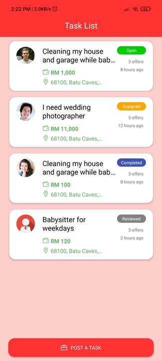 | 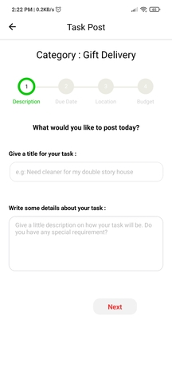  | 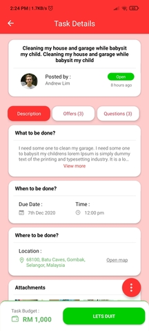  | 
| Task Details - FAB                               | Task Details - Description                        | Task Details - Offers                             |
| 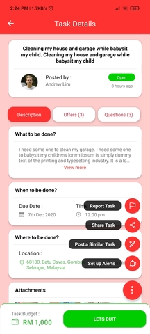 | 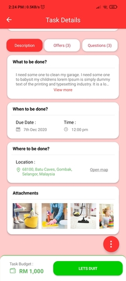  | 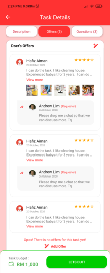  |    
| Task Details - Question                          | Task Details - Report Task Modal                  | Task Details - Add Question Modal                 |
| 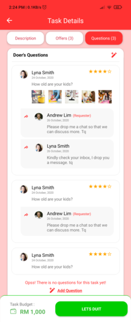 | 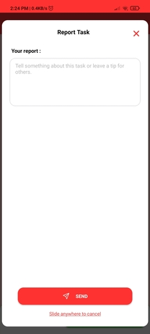  | 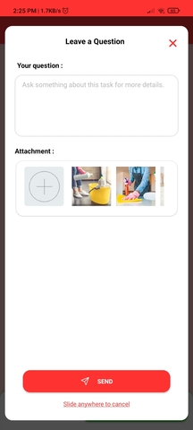  |    
| Lets Duit                                        | Task Details - Assigned                           | Task Details - Completed                          |
| 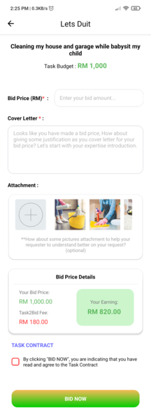| 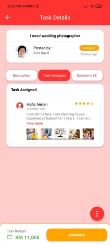  | 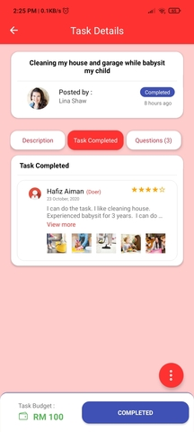  |    
| Task Details - Reviewed                          | 
| 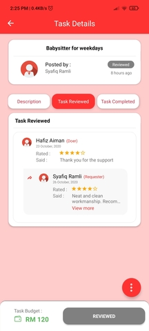 |
